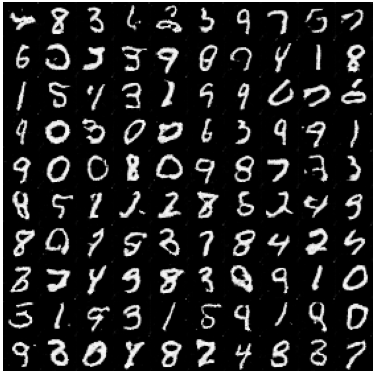
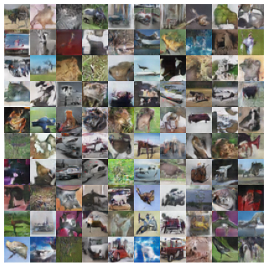
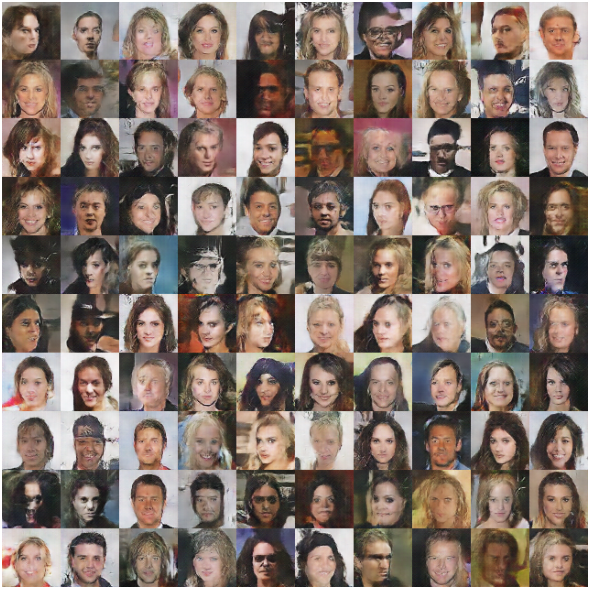

# GAN JAX - A toy project to generate images from GANs with JAX

This project aims to bring the power of [JAX](https://jax.readthedocs.io/en/latest/index.html), a Python framework developped by Google and DeepMind to train Generative Adversarial Networks for images generation.

## JAX


 JAX is a framework developed by Deep-Mind (Google) that allows to build machine learning models in a more powerful (XLA compilation) and flexible way than its counterpart Tensorflow, using a framework almost entirely based on the `nd.array` of numpy (but stored on the GPU, or TPU if available). It also provides new utilities for gradient computation (per sample, jacobian with backward propagation **and** forward-propagation, hessian...) as well as a better seed system (for reproducibility) and a tool to batch complicated operations automatically and efficiently.

 Github link: <https://github.com/google/jax>

## GAN


Generative adversarial networks (GANs) are algorithmic architectures that use two neural networks, pitting one against the other (thus the *adversarial*) in order to generate new, synthetic instances of data that can pass for real data. They are used widely in image generation, video generation and voice generation.
GANs were introduced in a paper by Ian Goodfellow and other researchers at the University of Montreal, including Yoshua Bengio, in 2014. Referring to GANs, Facebook’s AI research director Yann LeCun called adversarial training *the most interesting idea in the last 10 years in ML*. ([source](https://wiki.pathmind.com/generative-adversarial-network-gan))

Original paper: <https://arxiv.org/abs/1406.2661>

Some ideas have improved the training of the GANs by the years. For example:

Deep Convolution GAN (DCGAN) paper: <https://arxiv.org/abs/1511.06434>

Progressive Growing GAN (ProGAN) paper: <https://arxiv.org/abs/1710.10196>

The goal of this project is to implement these ideas in JAX framework.

## Installation

You can install JAX following the instruction on [JAX - Installation](https://github.com/google/jax#installation)

**It is strongly recommended to run JAX on Linux with CUDA available** (Windows has no stable support yet). In this case you can install JAX using the following command:

```script
pip install --upgrade "jax[cuda]" -f https://storage.googleapis.com/jax-releases/jax_releases.html
```

Then you can install [Tensorflow](https://www.tensorflow.org/) to benefit from `tf.data.Dataset` to handle the data and the pre-installed dataset. However, Tensorfow allocate memory of the GPU on use (which is not optimal for running calculation with JAX). **Therefore, you should install Tensorflow on the CPU instead of the GPU**. Visit this site [Tensorflow - Installation with pip](https://www.tensorflow.org/install/pip?hl=en#package-location) to install the CPU-only version of Tensorflow 2 depending on your OS and your Python version.

Exemple with Linux and Python 3.9:

```script
pip install tensorflow -f https://storage.googleapis.com/tensorflow/linux/cpu/tensorflow_cpu-2.6.0-cp39-cp39-manylinux2010_x86_64.whl
```

Then you can install the other librairies from requirements.txt. It will install [Haiku](https://dm-haiku.readthedocs.io/en/latest/) and [Optax](https://optax.readthedocs.io/en/latest/), two usefull add-on libraries to implement and optimize machine learning models with JAX.

```script
pip install -r requirements.txt
```

## Install CelebA dataset (optional)

To use the CelebA dataset, you need to download the dataset from [Kaggle](https://www.kaggle.com/jessicali9530/celeba-dataset) and install the images in the folder `img_align_celeba/` in `data/CelebA/images`. It is recommended to download the dataset from this source because the faces are already cropped.

Note: the other datasets will be automatically installed with `keras` or `tensorflow-datasets`.

## Quick Start

You can test a pretrained GAN model by using `apps/test.py`. It will download the model from pretrained models (in `pre_trained/`) and generate pictures. You can change the GAN to test by changing the path in the script.

You can also train your own GAN from scratch with `apps/train.py`. To change the parameters of the training, you can change the configs in the script. You can also change the dataset or the type of GAN by changing the imports (there is only one workd to change for each).

Example to train a GAN in celeba (64x64):

```script
from utils.data import load_images_celeba_64 as load_images
```

To train a DCGAN:

```script
from gan.dcgan import DCGAN as GAN
```

Then you can implement your own GAN and train/test them in your own dataset (by overriding the appropriate functions, check the examples in the repository).

## Some results of pre-trained models

### - Deep Convolution GAN

* On MNIST:



* On Cifar10:



* On CelebA (64x64):



### - Progressive Growing GAN

* On MNIST:

* On Cifar10:

* On CelebA (64x64):

* On CelebA (128x128):
